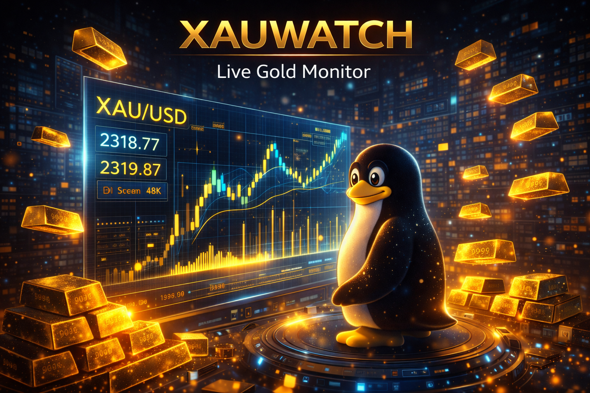
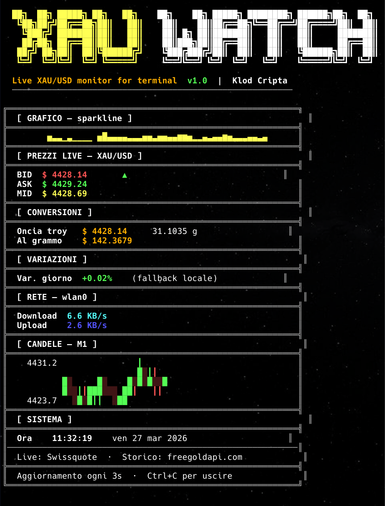

<p align="center">
  
</p>

<h1 align="center">XAUWATCH – Live Gold Monitor</h1>

<p align="center">
A Bash tool that displays the live price of gold (XAU/USD) directly in your terminal.
</p>

<p align="center">
  
  
  
</p>

---

XAUWATCH is a lightweight terminal-based monitor for the XAU/USD pair.

It provides real-time bid and ask prices, spread, and gold value conversions in a clean and readable interface.

The tool is designed for quick monitoring, without requiring a browser or external applications.

---

## Screenshot

<p align="center">
  
</p>

---

## Features

- Live gold price (XAU/USD)
- Bid / Ask and spread
- Price per gram and troy ounce
- Daily variation (external reference)
- Terminal-based interface with structured layout

---

## Installation

### Clone the repository

```bash
git clone https://github.com/KlodCripta/xauwatch.git
cd xauwatch
chmod +x xauwatch.sh
./xauwatch.sh
```

## Usage
```bash
./xauwatch.sh
```
## Requirements

- bash
- curl
- python
- awk

## Notes

Live data is fetched from Swissquote
Daily variation is based on external reference data
This tool is intended for monitoring purposes only

## License

This project is released under the MIT License.
